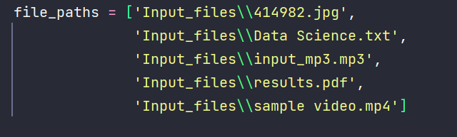
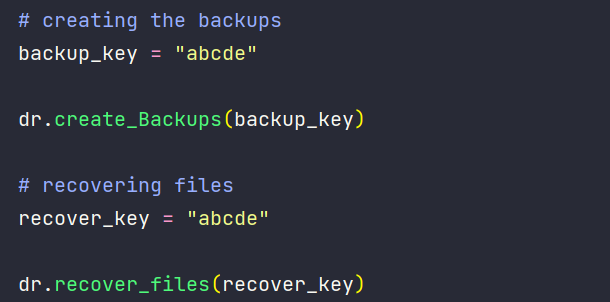

# Data Recovery Project

Often times we want to take backups of our files in a secure manner.
We also want our backups to take as less space as possible.

That's where this project comes into play.
With this project, we want to take backup of our files. The backup
takes less space as compared to original file. Also, the backup is encrypted.
We provide a key while calling the function responsible for creating backups.

With the help of this key, our backups are encrypted. While recovering
original data from backups, we need to provide a key. If the key is right, 
the data recovered is correct. If key is wrong, data recovered is wrong.

# PseudoCode

#### Creating Backups

1) Iterate over all the input files.

2) For each file, provide a key.

3) Create a Huffman Coding object for this file.
The Huffman Coding object is responsible for compressing this file.
Also, it uses a Cipher to encrpyt the compressed file. The Cipher uses the provided key.
Create the backup using this for all files.

4) Store the Huffman Coding Object for later use. This helps in recovering data from backups.

5) Save the backup file.

#### Recovering Files from Backups

1) Iterate over all the backup files.

2) For each file, we provide a key.

3) Get the Huffman Coding Object for this particular backup file.

4) Decrypt the Backup File using the key provided.

5) Recover data from the Decrypted File.

6) Save the recovered file.

# Navigation

1) backups: Folder containing the back up files which are generated from original files.

2) Cipher: Package containing module and classes for encrypting and decrypting the compressed backup file. This class 
ensures that proper authentication is required before right data can be recovered.  

3) Data Recovery: Package containing the modules and classes for creating backups and recovering data from backups.
Classes within it call the HuffmanCoding class and Cipher classes.

4) Huffman Coding: Package containing modules and classes to compress files and generate backups.
It uses Cipher class to encrypt the backups. While recovering data from backup files, Cipher class is used to Decrypt the backup data before recovering the data.

5) logger: Package containing modules and classes to implement the Logger class.

6) recovered_files: Folder which contains the recovered files from the backups files.

7) staging: Folder which stores all the input files in one place.

# Screenshots

#### Input Files Path

======================================================================================================================

### Backup Key - Recovery Key Same

//////////////////////////////////////////////////////////////////////////////////////////////////////

#### Backup Key and Recovery Key

/////////////////////////////////////////////////////////////////////////////////////////////////////
